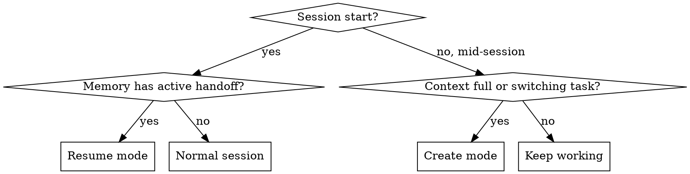

# Session Handoff

Seamless context transfer between sessions. Two modes: **create** (end of session) and **resume** (start of session).

## When to Use



## Create Mode (End of Session)

1. **Collect state:** `git log --oneline -5`, `git status`, pending decisions
2. **Write handoff** to `docs/handoff/YYYY-MM-DD-<topic>.md` using template below
3. **Update memory:** write/update `session_handoff.md` with pointer + one-line summary
4. **Commit** handoff doc (force add if gitignored)
5. **Tell user** to `/clear` and paste: `docs/handoff/YYYY-MM-DD-<topic>.md oku ve devam et`

### Handoff Template

```markdown
# Session Handoff: [Topic]

## Bu Session'da Yapılanlar
- [bullet points — what was built/fixed/changed]

## Mevcut Durum
- Branch: [branch name]
- Son commit: [hash + message]
- Bekleyen değişiklik: [var/yok — if var, list files]

## Sonraki Görev
[Exact task — which skill to invoke (brainstorm/writing-plans/implementing), what to build]

## Kararlar
- [decisions made this session that shouldn't be re-discussed]

## Dokunulacak Dosyalar
- [exact file paths for next task]

## Dikkat Edilecekler
- [gotchas, blockers, things that failed and why]
```

**Iron rule:** New session must be able to start working WITHOUT asking clarifying questions.

## Resume Mode (Start of Session)

1. **Read** the handoff doc pointed to by `session_handoff.md` in memory
2. **Verify** git state matches what handoff says (branch, last commit)
3. **Clear handoff** from memory (set to "no active handoff") after reading
4. **Continue** from "Sonraki Görev" — invoke the specified skill and start

## Quick Reference

| Action | What to do |
|--------|-----------|
| Context full, more work left | Create mode → handoff doc → memory → tell user /clear |
| New session, handoff exists | Resume mode → read doc → verify git → clear memory → continue |
| Handoff doc is stale | Delete it, remove memory pointer, start fresh |
| Multiple pending tasks | One handoff per topic, prioritize in memory |
